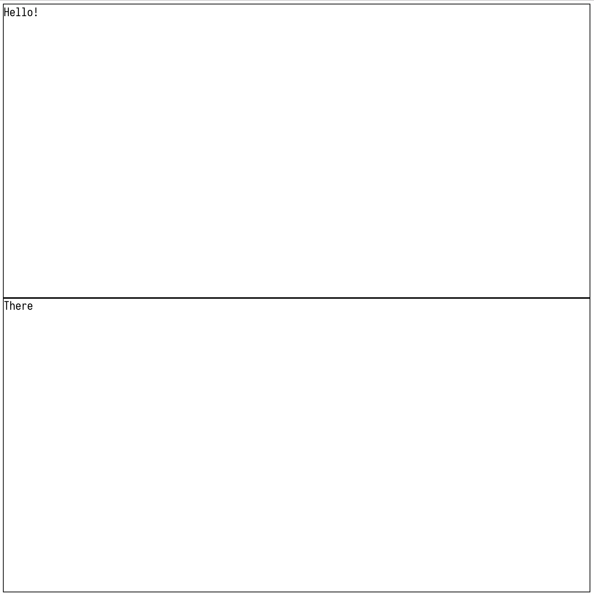
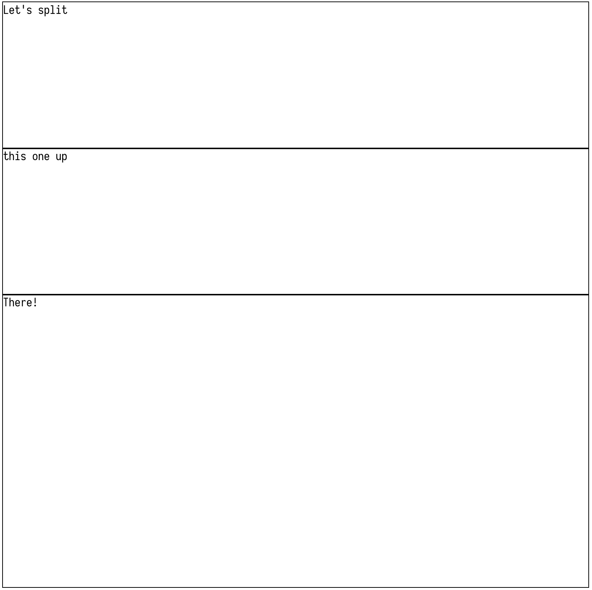
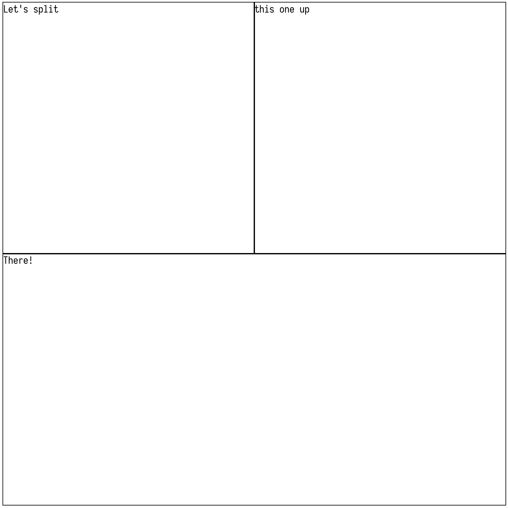
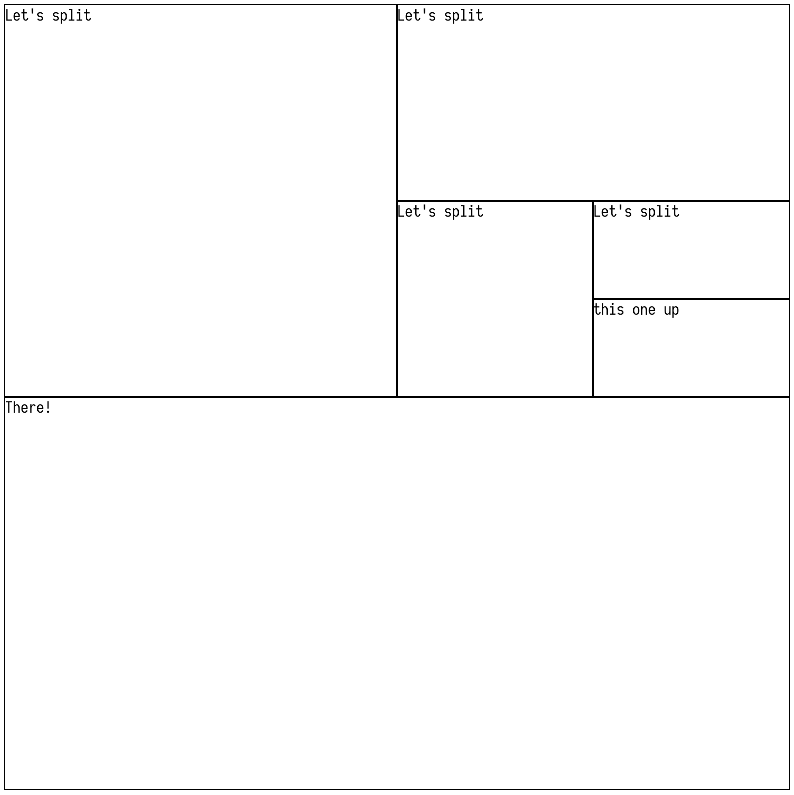
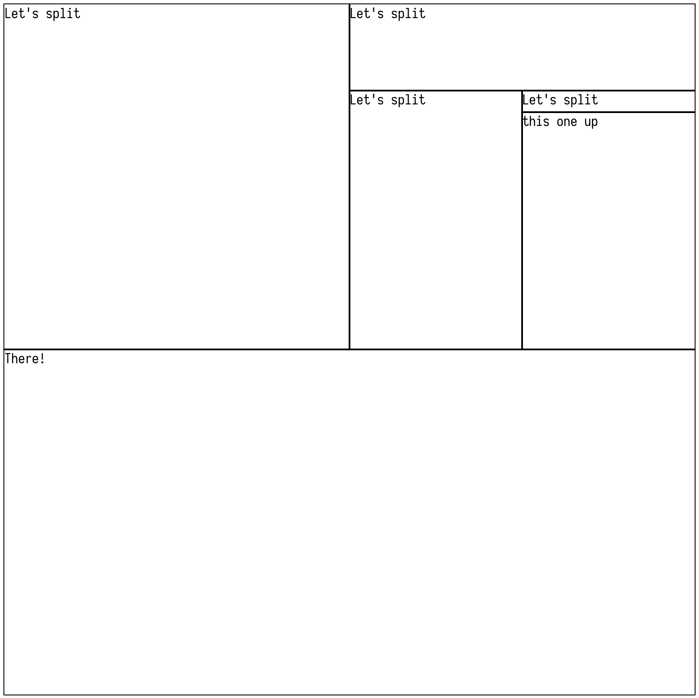
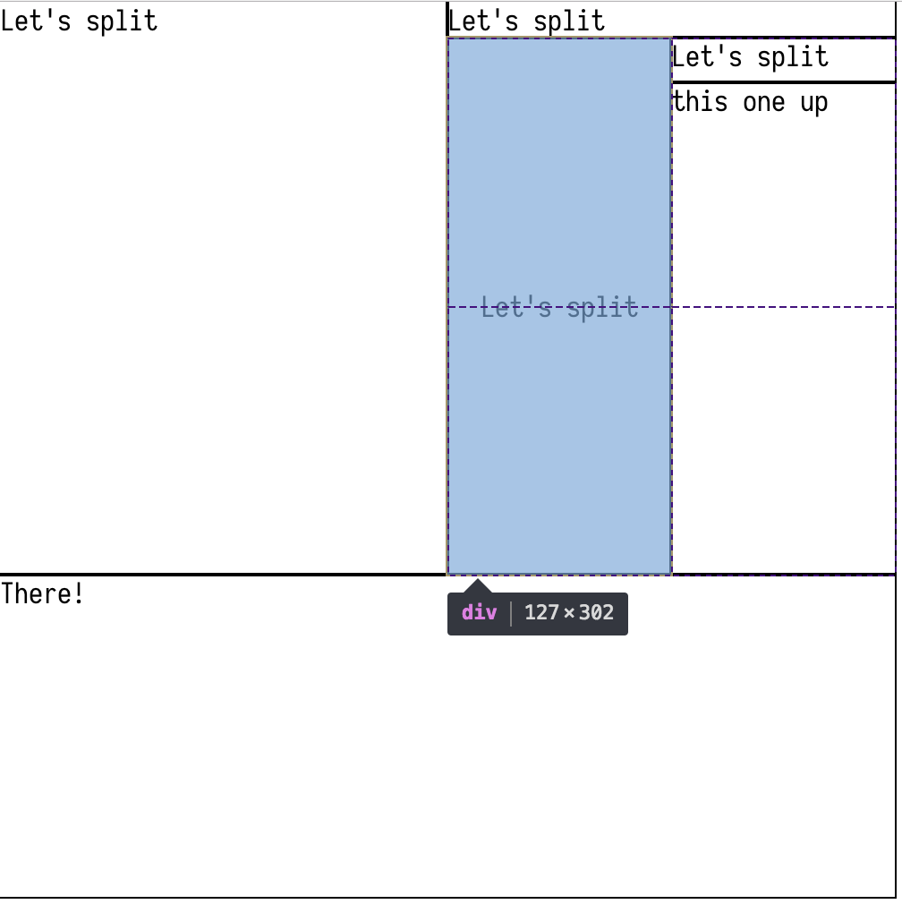

# CSS Grid Components

## Getting Started

### Installation

```
yarn add css-grid-components
```

### Usage

```
import React from 'react';
const { Grid, GridElement } = require('css-grid-components');
// or
// import { Grid, GridElement } from 'css-grid-components';

class myGrid extends React.Component {
  render() {
    return (
      <div style={{
        height: '800px',
        width: '800px',
        padding: '5px'
      }}>
        <Grid>
          <GridElement gridKey={0}>
            Hello
          </GridElement>
          <GridElement gridKey={1}>
            There!
          </GridElement>
        </Grid>
      </div>
    );
  }
}
```
#### Result


```
// Split up the first element
return (
  <div style={{
    height: '800px',
    width: '800px',
    padding: '5px'
  }}>
    <Grid>
      <GridElement gridKey={0}>
        <GridElement gridKey={2}>
          Let's split
        </GridElement>
        <GridElement gridKey={3}>
          this one up
        </GridElement>
      </GridElement>
      <GridElement gridKey={1}>
        There!
      </GridElement>
    </Grid>
  </div>
);
```
#### Result


```
// Set the parent element to 'columns' to change children orientation
return (
  <div style={{
    height: '800px',
    width: '800px',
    padding: '5px'
  }}>
    <Grid>
      <GridElement gridKey={0} columns>
        <GridElement gridKey={2}>
          Let's split
        </GridElement>
        <GridElement gridKey={3}>
          this one up
        </GridElement>
      </GridElement>
      <GridElement gridKey={1}>
        There!
      </GridElement>
    </Grid>
  </div>
);
```
#### Result

```
// Can create grids within grids
return (
  <div style={{
    height: '800px',
    width: '800px',
    padding: '5px'
  }}>
    <Grid>
      <GridElement gridKey={0} columns>
        <GridElement gridKey={2}>
          Let's split
        </GridElement>
        <GridElement gridKey={3}>
          <GridElement gridKey={4}>
            Let's split
          </GridElement>
          <GridElement gridKey={5} columns>
            <GridElement gridKey={6}>
              Let's split
            </GridElement>
            <GridElement gridKey={7}>
              <GridElement gridKey={8}>
                Let's split
              </GridElement>
              <GridElement gridKey={9}>
                this one up
              </GridElement>
            </GridElement>
          </GridElement>
        </GridElement>
      </GridElement>
      <GridElement gridKey={1}>
        There!
      </GridElement>
    </Grid>
  </div>
);
```
#### Result


```
// Set height and width of columns/rows
return (
  <div style={{
    height: '800px',
    width: '800px',
    padding: '5px'
  }}>
    <Grid>
      <GridElement gridKey={0} columns>
        <GridElement gridKey={2}>
          Let's split
        </GridElement>
        <GridElement gridKey={3}>
          <GridElement gridKey={4}>
            Let's split
          </GridElement>
          <GridElement height={'300px'} gridKey={5} columns>
            <GridElement gridKey={6}>
              Let's split
            </GridElement>
            <GridElement gridKey={7}>
              <GridElement height={'25px'} gridKey={8}>
                Let's split
              </GridElement>
              <GridElement gridKey={9}>
                this one up
              </GridElement>
            </GridElement>
          </GridElement>
        </GridElement>
      </GridElement>
      <GridElement gridKey={1}>
        There!
      </GridElement>
    </Grid>
  </div>
```
#### Result


## PropTypes

### Grid
None. Grid is used as a wrapper for React's Context API. It passes a 'gridStore' with information pertaining to all children (and children of children, and so on). With a complete picture of the overall node tree, it can determine the grid positions and sizes of each child, storing individual child information in the gridStore, which children components access and set their relative grid positions (and any styles required to fit them alongside other children, some of which might have declared dimensions).

New grid elements can be created with minimal work required from the Grid. Instead of frequently checking the tree for new child nodes, it passes a callback to Consumers to call when they mount. The callback provides any information relevant to the Grid to update the gridStore.

### GridElement
#### gridKey
Any - Required. Should be unique to each GridElement, but in theory can be used to reuse styling/position for multiple GridElements, since GridElements use their gridKey to obtain information about their position/dimensions. Recommended to stick to strictly unique schema.
#### columns
[Boolean = false] - Aligns children as columns instead of defaulting to rows.
#### width
[String] - Anything accepted as a unit for the css property `grid-template-columns` ('fr', 'px', etc)
#### height
[String] - Anything accepted as a unit for the css property `grid-template-rows` ('fr', 'px', etc)
#### centered
[Boolean = false] - Only accepted by leaf node (no children). Centers inner content of GridElement
